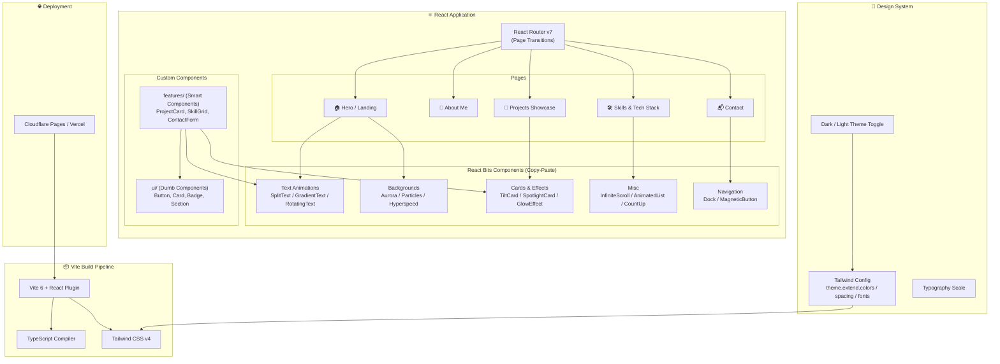
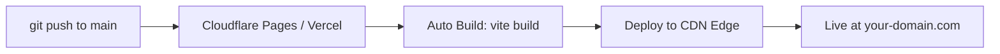

# Portfolio 項目 — 技術架構規劃

## 🎯 目標

構建一個高質感的個人 Portfolio 網站，利用 **React Bits** 的動畫組件打造視覺衝擊力強的互動體驗，展示個人技能、項目經歷與聯繫方式。

---

## 技術棧選型

| 層級 | 技術 | 理由 |
|------|------|------|
| **Build Tool** | Vite 6 | 極速 HMR、輕量、無需 SSR 的靜態站點首選 |
| **Framework** | React 19 + TypeScript | 類型安全、生態豐富 |
| **動畫/互動組件** | React Bits (Copy-Paste) | 提供 100+ 高質量動畫組件，按需複製，零依賴膨脹 |
| **動畫引擎** | Framer Motion / GSAP | React Bits 底層依賴，提供流暢動畫能力 |
| **CSS 方案** | Tailwind CSS v4 | 工具優先 (Utility-First)、原子化 CSS、開發速度快 |
| **路由** | React Router v7 | SPA 頁面切換 + 頁面過渡動畫 |
| **部署** | Cloudflare Pages / Vercel | 全球 CDN、免費 HTTPS、自動 CI/CD |
| **圖標** | react-icons | 整合 20+ 圖標庫（FontAwesome, Material, Devicons 等）|
| **字體** | Google Fonts (Inter / Outfit) | 現代感 Sans-Serif |

> [!NOTE]
> React Bits 採用 **Copy-Paste** 模式 — 不是 npm 安裝，而是將所需組件源碼直接複製到項目中的 `components/reactbits/` 目錄。這保證了零外部依賴風險和完全的客製化能力。

---

## 架構圖



---

## 項目目錄結構

```
portfolio/
├── public/
│   ├── favicon.ico
│   ├── og-image.png
│   └── assets/              # 靜態圖片、簡歷 PDF 等
│
├── src/
│   ├── main.tsx              # 應用入口
│   ├── App.tsx               # 路由配置 + Layout
│   ├── index.css             # Tailwind 指令 + 全局樣式
│   │
│   ├── components/
│   │   ├── ui/               # 🔵 純展示組件 (Dumb)
│   │   │   ├── Button/
│   │   │   ├── Card/
│   │   │   ├── Badge/
│   │   │   └── SectionHeading/
│   │   │
│   │   ├── features/         # 🟢 業務組件 (Smart)
│   │   │   ├── Navbar/
│   │   │   ├── HeroSection/
│   │   │   ├── ProjectCard/
│   │   │   ├── SkillGrid/
│   │   │   ├── Timeline/
│   │   │   └── ContactForm/
│   │   │
│   │   └── reactbits/        # 🟣 React Bits 組件 (Copy-Paste)
│   │       ├── SplitText/
│   │       ├── GradientText/
│   │       ├── Aurora/
│   │       ├── TiltCard/
│   │       ├── SpotlightCard/
│   │       ├── Dock/
│   │       ├── CountUp/
│   │       └── ...
│   │
│   ├── pages/                # 頁面級組件
│   │   ├── HomePage.tsx
│   │   ├── AboutPage.tsx
│   │   ├── SkillsPage.tsx
│   │   ├── ProjectsPage.tsx
│   │   └── ContactPage.tsx
│   │
│   ├── data/                 # 靜態數據 (JSON / TS)
│   │   ├── projects.ts       # 項目列表
│   │   ├── skills.ts         # 技能數據
│   │   └── personal.ts       # 個人資訊
│   │
│   ├── hooks/                # 自定義 Hooks
│   │   ├── useTheme.ts
│   │   ├── useScrollReveal.ts
│   │   └── useMediaQuery.ts
│   │
│   └── types/                # TypeScript 類型
│       └── index.ts
│
├── index.html
├── vite.config.ts
├── tailwind.config.ts        # Tailwind 主題配置（v4 可選，也可用 CSS-first config）
├── tsconfig.json
├── package.json
└── .gitignore
```

---

## 頁面規劃 & React Bits 組件對應

| 頁面 | 核心功能 | 候選 React Bits 組件 |
|------|----------|---------------------|
| **Hero / Landing** | 全屏視覺衝擊、個人名稱動畫、CTA 按鈕 | `Aurora` 背景, `SplitText` 名字動畫, `GradientText`, `MagneticButton` |
| **About Me** | 個人介紹、照片、簡歷下載 | `BlurText` 段落動畫, `TiltCard` 照片卡片 |
| **Skills** | 技術棧展示、熟練程度 | `CountUp` 數據動畫, `InfiniteScroll` 技術 Logo, `AnimatedList` |
| **Projects** | 項目卡片、篩選、詳情 | `SpotlightCard`, `TiltCard`, `PixelTransition` 切換效果 |
| **Contact** | 聯繫表單、社交連結 | `Dock` 社交媒體導航, `ClickSpark` 按鈕效果 |

---

## 設計方向

- **配色方案**: 深色主題為主（#0a0a0f 基底），搭配漸變霓虹色系強調色（紫→藍→青）
- **排版**: 大標題 + 充足留白 + 流暢的滾動動畫
- **互動感**: 滑鼠追蹤效果、磁吸按鈕、卡片傾斜、頁面過渡動畫
- **響應式**: Mobile-First，三段式斷點 (mobile / tablet / desktop)

---

## 部署流程



---

## User Review Required

> [!IMPORTANT]
> 在開始實作前，需要你確認以下幾個問題，以確保架構方向正確。

---

## Open Questions — 採訪環節 🎤

### 1. 📄 頁面結構
- 你傾向 **單頁滾動式 (SPA Scroll)** 還是 **多頁面路由切換**？
  - 單頁：所有內容在一個頁面上，用滾動瀏覽（更有沈浸感）
  - 多頁：每個區塊是獨立頁面，用 React Router 切換（更有結構感）

### 2. 👤 個人資訊
- 你的**全名 / 英文名**是什麼？（用於 Hero 區域的大標題動畫）
- 你的**職稱 / 定位**是什麼？例如 "Full-Stack Developer"、"Frontend Engineer" 等
- 你有**個人 Logo** 嗎？還是需要純文字 Logo？

### 3. 🛠 技能展示
- 你想展示哪些**技術棧**？請列出你的主要技能（例如 React, Node.js, Docker, etc.）
- 需要分類嗎？（例如 Frontend / Backend / DevOps / Tools）

### 4. 📂 項目展示
- 你有多少個**想展示的項目**？大約幾個？
- 每個項目需要展示什麼資訊？（標題、描述、技術標籤、Live Demo 連結、GitHub 連結、截圖？）

### 5. 📬 聯繫方式
- 你需要一個**聯繫表單**（需要後端或第三方服務如 Formspree）還是純**社交連結展示**就夠?
- 你有哪些**社交平台**連結想放？（GitHub, LinkedIn, Twitter/X, Email, etc.）

### 6. 🎨 設計偏好
- 你喜歡**純深色主題**，還是需要**深色/淺色切換**？
- 有沒有你喜歡的 Portfolio 參考網站？（可以貼連結給我）

### 7. 🌐 部署 & 域名
- 你打算部署到哪裡？**Cloudflare Pages** / **Vercel** / **GitHub Pages** / 其他？
- 你有自己的**域名**嗎？

### 8. 🎨 Tailwind CSS 版本確認
- 你要用 **Tailwind CSS v4**（最新，CSS-first config）還是 **v3**（穩定，JS config）？我預設用 **v4**，可以嗎？

### 9. 🌍 語言
- Portfolio 內容用**英文**還是**中文**？還是需要**雙語切換**？

---

## Verification Plan

### Automated Tests
- `npm run build` 確保零 TypeScript 錯誤
- Lighthouse 跑分 ≥ 90 (Performance, Accessibility, SEO)
- 所有頁面的響應式斷點在瀏覽器中驗證

### Manual Verification
- 啟動 `npm run dev` 後在瀏覽器中逐頁檢查動畫效果
- 測試 Mobile / Tablet / Desktop 三種視窗大小
- 確認所有 React Bits 組件正確渲染且動畫流暢
